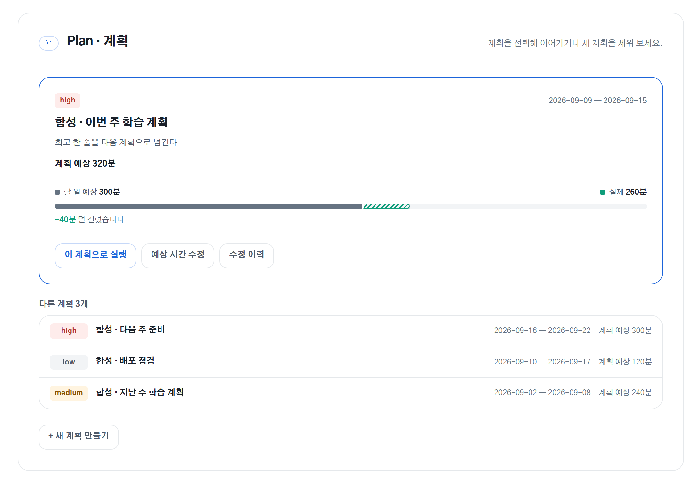
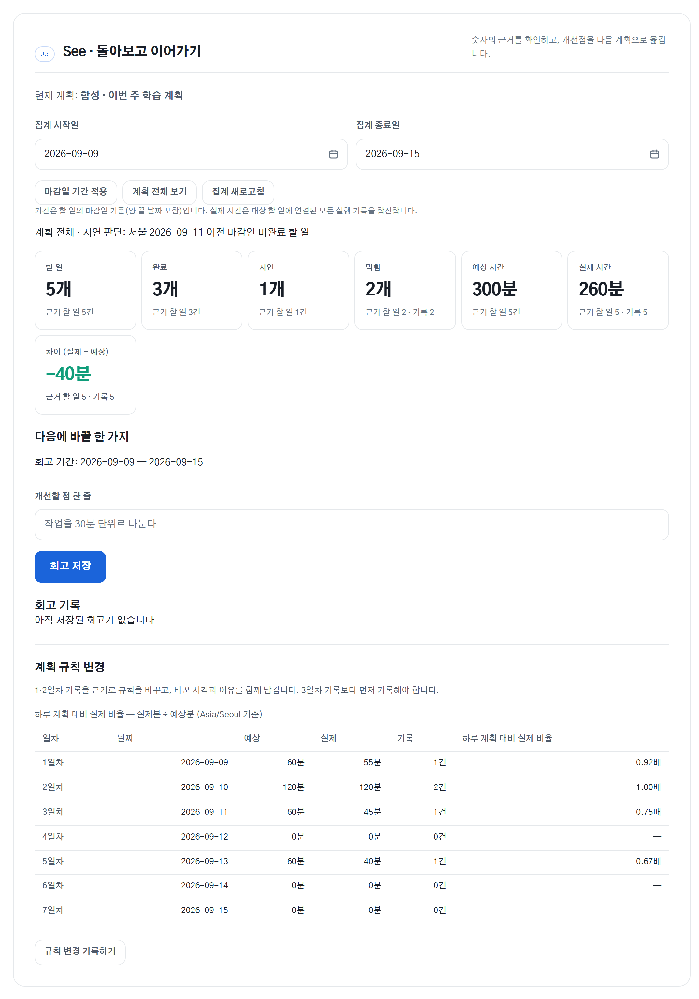
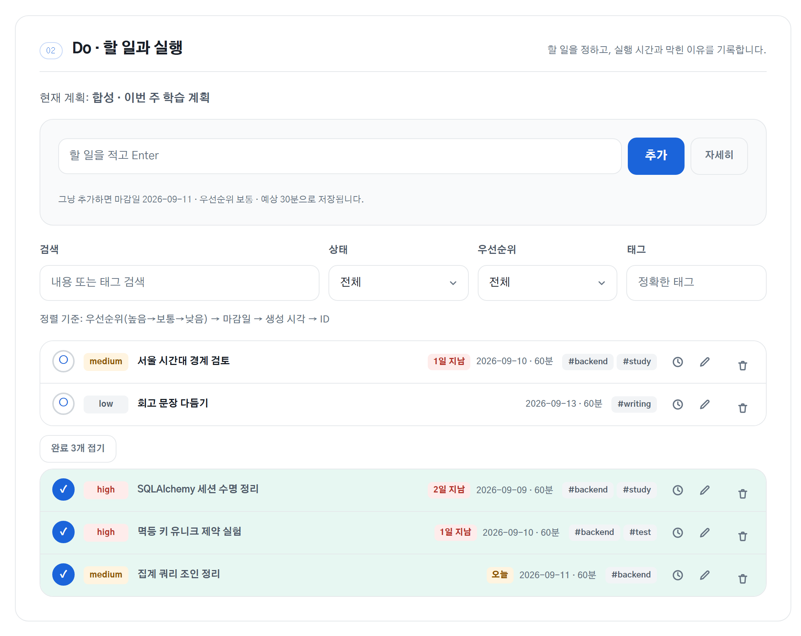
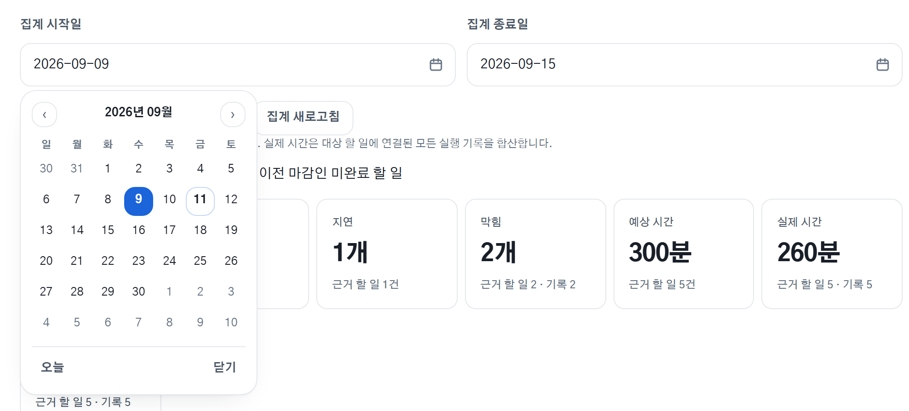

<div align="center">

# 플랜두씨 다이어리

**계획한 나와 실제의 차이를 기록하고, 다음 계획을 더 정확하게 만듭니다.**

계획(Plan) → 실제로 한 일(Do) → 돌아보기(See)를 하나의 흐름으로 잇는 공개 다이어리

[**앱 열기**](https://t06-plando-see-diary.onrender.com) · [제출 소스](https://github.com/myeongjundev/t06-plando-see-diary/tree/t06-submission) · [설계 기록](docs/DESIGN.md) · [결정 로그](docs/DECISIONS.md)

`React + TypeScript` `Flask + SQLAlchemy` `PostgreSQL` `Docker` `Render + Neon`

</div>

<picture>
  <source media="(prefers-color-scheme: dark)" srcset="docs/screenshots/plan-dark.png">
  
</picture>

---

## 무엇을 풀었나

계획은 세우는 순간 잊히고, 끝나고 나면 "왜 이렇게 오래 걸렸지"만 남습니다.
이 앱은 그 사이를 기록으로 잇습니다. 예상 시간을 적고, 실제로 걸린 시간과 막힌
이유를 남기고, 둘의 **차이를 근거와 함께** 보여준 뒤, 거기서 나온 개선점 한 줄을
다음 계획으로 옮깁니다.

핵심은 숫자를 보여주는 게 아니라 **숫자를 믿을 수 있게 만드는 것**입니다. 집계
카드를 누르면 그 숫자를 만든 할 일과 실행 기록의 ID가 그대로 나옵니다.

## 화면

### See · 돌아보고 이어가기

일곱 개 집계와, 각 숫자가 어떤 기록에서 나왔는지. 차이는 부호를 살려
초과는 빨강, 절약은 초록으로 표시합니다.

<picture>
  <source media="(prefers-color-scheme: dark)" srcset="docs/screenshots/see-dark.png">
  
</picture>

### Do · 할 일과 실행

할 일 등록·검색·필터와 고정된 정렬 기준. 끝난 일은 목록 아래로 접히고, 펼치면
초록으로 칠해집니다 — 취소선을 긋지 않는 이유는 그 내용을 되돌리기와 실행 기록
짝짓기에서 여전히 읽어야 하기 때문입니다.



### 직접 그린 컨트롤

달력·시각·드롭다운의 펼친 모습은 브라우저가 그리는 위젯이라 CSS가 닿지 않습니다.
그래서 직접 만들었고, 여기서부터는 목록도 화면의 나머지와 같은 색·반경·간격을 씁니다.

<picture>
  <source media="(prefers-color-scheme: dark)" srcset="docs/screenshots/controls-dark.png">
  
</picture>

> 화면의 자료는 전부 합성 예시입니다. 실제 기록은 저장소에 넣지 않습니다.

## 설계에서 신경 쓴 것

**중복 완료를 화면이 아니라 데이터베이스가 막습니다.**
완료 버튼을 빠르게 두 번 누르거나 요청이 재전송돼도 완료 이력은 한 건만 남아야
합니다. 버튼 비활성화는 경합을 막지 못하므로, 클라이언트가 보낸 멱등 키에 유니크
제약을 걸고 상태 전이와 이력 기록을 한 트랜잭션에 묶었습니다. 되돌린 뒤 옛 키가
다시 도착해도 원래 이력을 돌려줄 뿐 다시 완료되지 않습니다.
→ [`services/executions.py`](backend/app/services/executions.py) · D-009, D-011

**집계는 숫자만 주지 않고 근거를 함께 돌려줍니다.**
일곱 개 지표를 하나의 조인 결과에서 계산해, 합계와 근거 목록이 어긋날 수 없게
했습니다. 화면의 각 카드는 자기 숫자를 만든 할 일·실행 기록 ID를 그대로 보여줍니다.
→ [`services/reflections.py`](backend/app/services/reflections.py) · D-014, D-015

**시간은 UTC로 저장하고 서울 기준으로 판단합니다.**
실행 기록은 오프셋이 있는 시각으로만 받고 UTC로 저장하며, 화면에는
`Asia/Seoul`로 표시합니다. 지연 여부도 서울 날짜로 판정합니다. 실제로 일한 시간은
경과 시간과 다를 수 있어서(중간에 쉬면) 분 단위로 따로 입력받습니다.
→ [`app/time.py`](backend/app/time.py) · D-008, D-012

**로그인이 없다는 사실을 화면이 먼저 말합니다.**
T06 범위에 인증이 없으므로 첫 화면에 공개 안내를 두고, 응답에는 같은 출처만
허용하는 CSP를 붙였습니다. 글꼴도 외부 CDN 대신 번들해 이 정책을 지킵니다.
사용자가 넣은 문자열은 스크립트로 실행되지 않고 글자 그대로 렌더링됩니다.
→ [`app/__init__.py`](backend/app/__init__.py) · D-023

**마이그레이션은 값을 보존하고 반복해도 안전합니다.**
카드가 넘어갈 때마다 스키마가 늘었지만 기존 값은 그대로 남습니다. 배포는 서버가
뜨기 전에 마이그레이션을 먼저 돌리므로, 실패하면 조용히 잘못된 상태로 서비스되는
대신 아예 기동하지 않습니다.
→ [`migrations/`](backend/migrations) · [`deploy/start.sh`](deploy/start.sh)

**날짜·시각·드롭다운은 브라우저가 아니라 우리가 그립니다.**
`input[type="date"]`와 `select`의 펼친 목록은 브라우저가 그리는 위젯이라 CSS가 닿지
않습니다. 화면의 나머지가 전부 토큰 위에 올라가 있는데 그 둘만 OS 기본 모양이었습니다.
라이브러리 없이 달력·시각·목록을 직접 만들어, 목록 높이를 계획 목록과 같은 19rem으로
맞추고 계획 고르기에는 검색을 넣었습니다. 네이티브가 하던 일은 잃지 않았습니다 —
타자 입력, 화살표·Home/End 이동, 타자 검색, Escape가 그대로 있습니다. 대신 모바일에서
OS 시트를 잃는 건 값으로 치렀습니다.
→ [`components/DateField.tsx`](frontend/src/components/DateField.tsx) ·
[`components/Select.tsx`](frontend/src/components/Select.tsx) · D-049, D-050, D-054

**게이지의 기준선은 표식이 아니라 두 색이 만나는 자리입니다.**
예상 대비 실제를 그리면서 눈금자를 `max(예상, 실제)`로 잡으면 큰 쪽이 언제나 막대를
꽉 채웁니다. 그러면 기준선이 초과일 때와 절약일 때 다른 곳에 서서 계획끼리 비교가 안
되고, 10% 초과와 500% 초과가 같은 그림이 됩니다. 기준선을 한자리에 못 박아 채움 길이가
«계획 대비 몇 배»가 되게 하고, 계획대로 쓴 구간은 무채색으로, 넘어선 구간만 빨강으로
갈랐습니다. 색은 여기서도 상태일 때만 씁니다.
→ [`features/plans/PlanGauge.tsx`](frontend/src/features/plans/PlanGauge.tsx) · D-051, D-053

## 디자인

네 방향을 같은 데이터로 스케치해 성격만 다르게 두고 비교한 뒤, **"흐름"**을
골랐습니다. 제품 자체가 세 단계 반복이고, 화면의 구조가 그 구조를 말해 주는 건
그 안이 유일했기 때문입니다. 고른 이유와 버린 이유, 스케치 원본은
[`docs/DESIGN.md`](docs/DESIGN.md)에 있습니다.

| 방향 | 성격 | 비용 |
|---|---|---|
| A · 계측 | 고정폭 숫자, 기준선 대비 막대. 계기처럼 읽힘 | 가장 차갑다 |
| B · 저널 | 세리프, 숫자보다 문장이 먼저 | 따뜻하지만 서버·집계를 다룬 인상이 약해진다 |
| **C · 흐름** | **Plan → Do → See가 순서 있는 과정으로 읽힘. 파랑 하나** | **익숙한 만큼 개인의 판단이 덜 드러난다** |
| D · 운영 | 어두운 관제 보드, 차이를 최상단 지표로 | 밀도는 높지만 일기가 사라진다 |

토큰 한 겹 위에 올렸습니다. 강조색 하나와 상태를 뜻하는 색 셋, 반경 셋, 4px 간격
스케일, 글자 굵기 넷. **색은 장식이 아니라 상태일 때만** 씁니다 — 일곱 개 집계 중
부호가 의미를 갖는 "차이" 하나만 색을 가집니다. 라이트·다크 양쪽을 지원하고
`prefers-reduced-motion`을 존중합니다.

## 기술 구성

| 영역 | 선택 |
|---|---|
| Frontend | React · Vite · TypeScript |
| Backend | Flask · SQLAlchemy · Alembic |
| Database | PostgreSQL (테스트는 인메모리 SQLite) |
| 배포 | Docker · Waitress(비루트) · Render + Neon |
| 시간 | UTC 저장, `Asia/Seoul` 표시·날짜 판정 |
| 단위 | 분(minutes) |

## 검증

- 백엔드 자동 테스트 **53개 통과, 커버리지 92%**
- 고정 검사 **44개** — 공식 과제에서 뽑아 관찰 가능한 입력과 기대값으로 확정.
  통과시키려고 기대값을 낮추지 않는 것을 규칙으로 두었습니다.
  ([`docs/T06-ACCEPTANCE-MATRIX.md`](docs/T06-ACCEPTANCE-MATRIX.md))
- API 수준 검사로 덮이는 항목과, 배포본에서 눈으로 확인해야 하는 항목을 구분해
  기록합니다. 자동 검사는 DOM을 검증하지 않으므로 화면 회귀는 눈으로 잡습니다.

```powershell
backend/.venv/Scripts/python.exe -m pytest backend/tests
npm --prefix frontend test
npm --prefix frontend run build
```

T07에서 프런트엔드 자동 검사(vitest)가 붙었습니다. 세션 만료 복구와 라우트 관문은
브라우저 안에만 있어서 pytest가 볼 수 없기 때문입니다.

## 로컬 실행

```powershell
# 백엔드
cd backend
py -3.12 -m venv .venv
.\.venv\Scripts\python.exe -m pip install -e ".[dev]"
$env:REQUIRE_POSTGRES = "0"
.\.venv\Scripts\flask.exe --app app:create_app db upgrade
.\.venv\Scripts\flask.exe --app app:create_app run --host 127.0.0.1 --port 5000

# 프런트엔드 (다른 터미널)
cd frontend
npm ci
npm run dev -- --host 127.0.0.1
```

5000번을 다른 앱이 쓰고 있으면 백엔드 포트를 바꾸고 `$env:T06_API_TARGET`으로
그 주소를 알려 주면 됩니다. 자세한 내용은
[`docs/DEVELOPMENT.md`](docs/DEVELOPMENT.md).

## 문서

무엇이 유효한 기준이고 무엇이 지나간 기록인지는
[`docs/README.md`](docs/README.md)가 안내합니다.

| 문서 | 내용 |
|---|---|
| [`docs/DESIGN.md`](docs/DESIGN.md) | 방향 선택 근거, 토큰, 건드리면 안 되는 화면 요소 |
| [`docs/DECISIONS.md`](docs/DECISIONS.md) | 결정과 이유. 옛 결정은 고치지 않고 뒤집는 행을 더합니다 |
| [`docs/STATUS.md`](docs/STATUS.md) | 현재 상태, 근거, 남은 일 |
| [`docs/T06-ACCEPTANCE-MATRIX.md`](docs/T06-ACCEPTANCE-MATRIX.md) | 고정 검사 44개 |
| [`docs/REQUIREMENTS.md`](docs/REQUIREMENTS.md) | 확정 요구사항 |
| [`docs/FLASK-ARCHITECTURE.md`](docs/FLASK-ARCHITECTURE.md) | 구현 구조 |
| [`contracts/pds-schema-v2.json`](contracts/pds-schema-v2.json) | 데이터 계약 |
| [`docs/DEVELOPMENT.md`](docs/DEVELOPMENT.md) | 로컬 실행과 검사 명령 |
| [`docs/RENDER-NEON.md`](docs/RENDER-NEON.md) | 배포 방법 |

## 공개 데이터 주의

T06에는 로그인이 없습니다. 링크를 아는 사람은 누구나 볼 수 있습니다.
배포 화면에는 남이 봐도 괜찮은 기록만 넣고, 저장소·테스트·스크린샷·제출 증거에는
합성 자료만 사용합니다. 인증은 T07에서 추가하며, 지금은 그 확장 지점을 깨끗하게
남겨 두는 것까지가 범위입니다.
