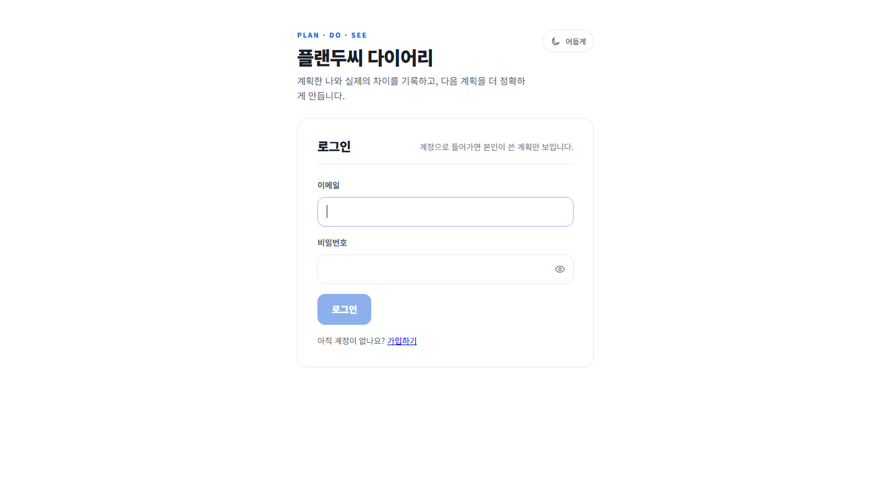
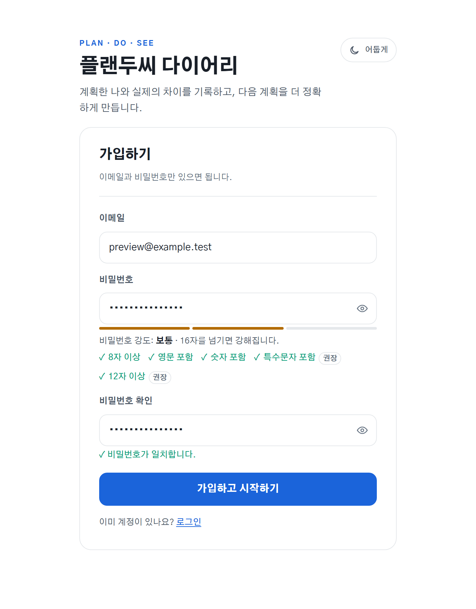
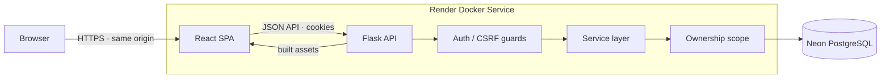
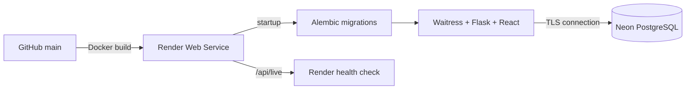

<div align="center">

# 플랜두씨 다이어리

### 계획과 실행의 차이를 근거로, 다음 계획을 더 정확하게

예상 시간과 실제 실행을 기록하고 **Plan → Do → See** 회고를 다음 계획으로 연결하는
개인 생산성 웹 애플리케이션입니다.

[**Live Demo**](https://t06-plando-see-diary.onrender.com) ·
[**Source**](https://github.com/myeongjundev/t07-plando-see-diary) ·
[**Architecture**](docs/T07-ARCHITECTURE.md) ·
[**Security Guide**](docs/T07-AUTH-GUIDE.md) ·
[**Decision Log**](docs/DECISIONS.md)

`React 19` `TypeScript` `Flask 3` `SQLAlchemy` `PostgreSQL` `Docker` `Render` `Neon`

</div>

<picture>
  <source media="(prefers-color-scheme: dark)" srcset="docs/screenshots/login-hero-dark.png">
  
</picture>

> 공개 화면과 문서의 예시는 합성 데이터입니다. 실제 개인 기록과 인증 정보는 저장소에
> 포함하지 않습니다. Live Demo에서는 테스트용 정보만 입력해 주세요.

## 프로젝트 소개

계획 앱은 많지만, 계획이 빗나간 이유를 다음 계획에 반영하기는 어렵습니다. 플랜두씨
다이어리는 단순한 할 일 목록 대신 아래 질문에 답하도록 설계했습니다.

> “나는 얼마나 계획과 다르게 행동했고, 그 차이를 다음에는 어떻게 줄일 것인가?”

사용자는 계획별 예상 시간을 정하고, 할 일과 실제 소요 시간을 별도로 기록합니다.
See 화면은 예상·실제·차이를 계산할 뿐 아니라 **그 숫자를 만든 원본 기록까지 함께**
보여줍니다. 회고에서 정한 개선점은 다음 계획으로 그대로 이어집니다.

| 구분 | 내용 |
| --- | --- |
| 형태 | 개인용 Plan–Do–See 다이어리 |
| 구현 범위 | 기획 · 설계 · 프런트엔드 · 백엔드 · DB · 배포 · 테스트 |
| 핵심 과제 | 신뢰할 수 있는 시간 집계, 계정별 데이터 격리, 안전한 세션 관리 |
| 운영 환경 | Render의 단일 Docker 서비스 + Neon PostgreSQL |
| 현재 상태 | T07 기능 운영 배포 완료 · 실제 5일 관찰 진행 중 |

## T07에서 확장한 인증 경계

T06의 공개형 다이어리를 단순히 로그인 화면으로 가린 것이 아니라, 저장 모델과 모든 데이터
접근 경로를 계정 기준으로 다시 설계했습니다. 기존 기록은 운영 DB에서 새 계정으로 안전하게
승계하고, 이후 목록·단건·집계·내보내기까지 서버가 현재 세션의 사용자로 범위를 정합니다.

가입 화면은 비밀번호 조건과 강도를 즉시 설명하지만, 최종 판단은 서버가 다시 수행합니다.
가입 성공 자체로 세션을 만들지 않고 곧바로 **일반 로그인 API를 다시 호출**합니다. 따라서
가입 직후와 기존 사용자의 로그인 사이에 서로 다른 세션 발급 경로가 생기지 않습니다.

<picture>
  <source media="(prefers-color-scheme: dark)" srcset="docs/screenshots/signup-hero-dark.png">
  
</picture>

## 핵심 기능

### Plan · 계획하기

- 기간, 우선순위, 예상 시간, 성공 기준을 포함한 계획 생성·수정·삭제
- 제목 검색과 최신순·중요도순·마감 임박순 정렬
- 예상 대비 실제 시간을 한눈에 비교하는 고정 기준선 게이지
- 회고의 개선 문장을 다음 계획에 자동으로 승계

### Do · 실행하기

- 마감일, 우선순위, 태그, 예상 시간을 가진 할 일 관리
- 상태·우선순위·태그 필터와 결정적인 정렬 규칙
- 시작·종료 시각과 실제 집중 시간, 막힌 이유를 실행 기록으로 보존
- 중복 클릭과 네트워크 재시도에도 완료 이력이 한 번만 생기는 멱등 처리

### See · 돌아보기

- 할 일·완료·지연·막힘 건수와 예상·실제·차이, 총 7개 지표 제공
- 각 지표를 만든 할 일 및 실행 기록을 드릴다운으로 확인
- 기간별 집계, 회고 저장, 회고에서 다음 계획 생성
- 1·2일차 실행을 근거로 계획 규칙을 바꾸고 변경 전후 지표 비교
- 계정의 전체 자료를 단일 JSON 파일로 내보내기

### Account · 내 기록 보호하기

- 회원가입, 로그인, 로그아웃, 비밀번호 변경, 계정 삭제
- 상단 설정 메뉴와 보호된 `/settings`에서 프로필·데이터 내보내기·보안 기능을 분리해 관리
- 회원가입 직후에도 기존 사용자와 동일한 로그인 경로를 거쳐 세션 발급
- 로그인하지 않은 사용자의 앱 화면 접근 차단
- 모든 조회·수정·삭제를 현재 계정 소유 데이터로 제한
- 비밀번호 변경과 로그아웃 즉시 기존 세션 폐기

## 화면

### 실행 기록

할 일과 실행 기록을 분리했습니다. 계획한 시간은 그대로 두고 실제 집중 시간은 별도
행으로 쌓기 때문에, 계획을 사후에 고쳐 오차를 감추지 않습니다.


### 근거가 보이는 회고

집계 카드를 선택하면 숫자의 출처인 할 일과 실행 기록 ID가 함께 나타납니다. 합계와
근거가 서로 다른 쿼리에서 어긋나지 않도록 한 조회 결과에서 함께 계산합니다.

<picture>
  <source media="(prefers-color-scheme: dark)" srcset="docs/screenshots/see-dark.png">
  
</picture>

### 제품과 같은 언어로 만든 컨트롤

브라우저마다 모양이 달라지는 날짜·시각·드롭다운을 디자인 토큰 위에서 직접
구현했습니다. 키보드 입력, 방향키 탐색, Home/End, Escape, 타자 검색을 지원하며
라이트·다크 테마와 `prefers-reduced-motion`을 존중합니다.

<picture>
  <source media="(prefers-color-scheme: dark)" srcset="docs/screenshots/controls-dark.png">
  
</picture>

## 시스템 구조

프런트엔드 빌드와 Flask API를 한 출처에서 제공해 인증 경계를 단순하게 유지했습니다.
라우트는 HTTP와 입력 검증에 집중하고, 비즈니스 규칙은 서비스 계층, 영속성 규칙은
모델과 데이터베이스 제약으로 나눴습니다.



```text
frontend/src/
├─ auth/                 로그인 화면, 라우트 관문, 세션 상태
├─ api/                  JSON API와 단일 Refresh 재시도
├─ components/           DateField, Select 공통 컨트롤
└─ features/             Plan, Do, See, Account, Export

backend/app/
├─ api/                  HTTP 엔드포인트와 입력 검증
├─ auth/                 쿠키, 인증 가드, CSRF
├─ security/             Argon2id, JWT, 비밀값 가림
├─ services/             소유권, 세션, 집계, 규칙 변경
└─ models/               SQLAlchemy 모델과 DB 제약
```

자세한 구조와 선택 근거는 [T07 아키텍처](docs/T07-ARCHITECTURE.md)와
[Flask 구조 문서](docs/FLASK-ARCHITECTURE.md)에 정리했습니다.

## 기술적으로 해결한 문제

### 1. 로그아웃한 JWT가 만료 전까지 살아 있는 문제

서명만 검증하는 JWT는 로그아웃 후에도 만료 전까지 유효합니다. Access JWT의 `sid`를
PostgreSQL 세션 행에 연결하고, 매 요청에서 세션의 생존 여부와 `sub` 소유자가 일치하는지
확인했습니다. 따라서 로그아웃이나 비밀번호 변경으로 서버 세션을 폐기하면 기존 Access
토큰도 즉시 거절됩니다.

→ [`auth/guards.py`](backend/app/auth/guards.py) ·
[`services/sessions.py`](backend/app/services/sessions.py)

### 2. Refresh 탈취와 동시 회전 문제

Refresh 원문은 쿠키에만 전달하고 DB에는 SHA-256 다이제스트만 저장합니다. 사용할 때마다
새 토큰으로 원자적으로 회전하며, 이미 회전한 토큰이 다시 들어오면 탈취 가능성으로 보고
같은 계열 전체를 폐기합니다. 프런트엔드는 탭 내부 요청을 single-flight로 직렬화해 정상
요청끼리의 경합을 줄였습니다.

→ [`security/tokens.py`](backend/app/security/tokens.py) ·
[`api/http.ts`](frontend/src/api/http.ts)

### 3. URL만 바꾸면 남의 자료가 보이는 IDOR 문제

사용자가 보낸 `userId`는 신뢰하지 않습니다. 목록은 처음부터 현재 계정으로 범위를 좁히고,
단건은 `(resource_id, current_user_id)`를 함께 조회합니다. 다른 계정의 ID는 존재 여부도
드러내지 않도록 404로 응답합니다. 두 계정 사이의 읽기·수정·삭제를 양방향으로 시도하고,
거절 전후 행 개수까지 비교해 데이터가 바뀌지 않았음을 검증했습니다.

→ [`services/ownership.py`](backend/app/services/ownership.py) ·
[`08-cross-user-access-blocked.md`](docs/T07-EVIDENCE/08-cross-user-access-blocked.md)

### 4. 운영 중인 T06 데이터를 계정 모델로 옮기는 문제

기존 공개형 스키마에 곧바로 `user_id NOT NULL`을 적용하면 운영 데이터가 마이그레이션을
막습니다. 그래서 계정·nullable 소유권 추가 → 백업 → 검토한 기존 행 claim → 미소유 행
0건 확인 → NOT NULL 적용의 순서로 나눴습니다. 실제 PostgreSQL의 FK 이름이 예상과 달랐던
문제는 이름을 가정하지 않고 메타데이터에서 제약을 찾도록 고쳐 회귀 테스트를 추가했습니다.

→ [`migrations/versions`](backend/migrations/versions) ·
[`deploy/start.sh`](deploy/start.sh)

### 5. 화면 합계와 원본 기록이 어긋나는 문제

일곱 지표와 근거 목록을 각각 계산하면 필터나 soft-delete 조건 하나만 달라도 결과가
갈라집니다. 집계 서비스는 하나의 조회 결과에서 값과 근거 ID를 함께 만들고, 시간은 UTC로
저장하되 날짜 경계와 지연 여부는 `Asia/Seoul` 기준으로 판정합니다. 관찰 지표의 반올림은
Python 기본 방식 대신 `Decimal(ROUND_HALF_UP)`으로 고정해 손계산과 일치시켰습니다.

→ [`services/reflections.py`](backend/app/services/reflections.py) ·
[`services/metrics.py`](backend/app/services/metrics.py) ·
[`time.py`](backend/app/time.py)

## 인증·보안 설계

직접 구현한 인증 흐름 위에 검증된 라이브러리의 암호 primitives를 사용했습니다. 해싱이나
JWT 알고리즘 자체를 직접 만들지 않았습니다.

### 회원가입부터 보호 API까지

```mermaid
flowchart LR
    subgraph Signup[회원가입]
      SF[React 가입 폼] --> UQ[JSON · Origin 검사]
      UQ --> VP[서버 입력·비밀번호 정책 검증]
      VP --> AH[Argon2id 해싱]
      AH --> UD[(users · email UNIQUE)]
    end

    UD -->|201 후 같은 로그인 API 호출| LI

    subgraph Login[로그인]
      LI[POST /api/auth/login] --> TH[DB 기반 시도 제한]
      TH --> PV[Argon2id 검증]
      PV --> SS[(refresh_sessions)]
      SS --> CK[Access · Refresh · CSRF 쿠키]
    end

    CK --> PR[보호 API 요청]
    PR --> JV[JWT 서명 · exp 검증]
    JV --> SB[sid 생존 · sub 소유자 검증]
    SB --> OW[현재 사용자로 ownership scope]
    OW --> DATA[(사용자 데이터)]

    CK -->|Access 만료| RF[Refresh + Origin + CSRF]
    RF -->|정상| ROT[토큰 원자적 회전]
    ROT --> CK
    RF -->|이미 쓴 토큰 재사용| RV[세션 계열 전체 폐기]
```



이 구조의 핵심은 브라우저가 보낸 사용자 ID가 아니라 **검증된 세션의 사용자 ID만** 데이터
조회에 사용한다는 점입니다. Access JWT의 서명만 맞아도 통과시키지 않고, `sid`가 가리키는
DB 세션이 살아 있으며 `sub`가 그 세션의 소유자와 같아야 합니다.

### 가입과 로그인에서 적용한 방어

| 단계 | 방어와 이유 |
| --- | --- |
| 요청 입구 | JSON 요청과 허용된 Origin만 받아 단순 폼 전송과 교차 출처 요청을 거절 |
| 회원가입 | 프런트 안내와 별개로 서버가 8자·영문·숫자 조건을 재검증하고, DB UNIQUE로 동시 중복 가입 차단 |
| 비밀번호 저장 | 임의 salt를 포함한 Argon2id 결과만 저장하고 원문은 응답·로그·보안 이벤트에 기록하지 않음 |
| 계정 탐색 방지 | 없는 이메일도 dummy Argon2 검증을 수행하고, 틀린 비밀번호와 같은 상태·문구로 응답 |
| 무차별 대입 | 계정 조회·해싱 전에 DB 기반 잠금을 확인하며, 원본 IP 대신 비밀키 HMAC만 저장 |
| 세션 발급 | Access·Refresh는 HttpOnly 쿠키, CSRF 값만 JavaScript가 읽을 수 있는 별도 쿠키로 전달 |
| 자료 접근 | 인증 가드 뒤에서 모든 쿼리를 현재 사용자로 제한하고 타인 자료는 404로 처리 |
| 세션 종료 | 로그아웃은 서버 세션을 먼저 폐기한 뒤 쿠키를 지우고, 비밀번호 변경은 다른 세션까지 폐기 |

### 세 쿠키의 역할 분리

| 쿠키 | JavaScript 접근 | SameSite / Path | 역할 |
| --- | --- | --- | --- |
| `__Host-pds_access` | 불가 | Lax / `/` | 10분 Access JWT, 매 요청의 인증 후보 |
| `__Secure-pds_refresh` | 불가 | Strict / `/api/auth` | 세션 연장용 난수 원문, DB에는 SHA-256만 저장 |
| `__Host-pds_csrf` | 가능 | Lax / `/` | 상태 변경 요청의 `X-CSRF-Token`과 일치 여부 확인 |

토큰은 URL, `localStorage`, `sessionStorage`, JSON 응답 본문에 넣지 않습니다. Access 만료 시
프런트는 Refresh 요청을 한 번만 수행하도록 직렬화하고, 서버는 토큰을 새 값으로 회전합니다.
이미 사용된 Refresh가 다시 오면 후계 토큰까지 포함한 세션 계열 전체를 폐기합니다.

| 영역 | 구현 |
| --- | --- |
| 비밀번호 | `argon2-cffi` Argon2id · 19,456 KiB · t=2 · p=1 |
| Access | PyJWT HS256 · 10분 · 서버 세션의 `sid`에 바인딩 |
| Refresh | 256-bit 난수 · DB에는 SHA-256만 저장 · 매 사용 회전 · 재사용 시 계열 폐기 |
| 세션 만료 | 48시간 유휴 만료 · 로그인 시점부터 14일 절대 만료 |
| 쿠키 | Secure · Domain 미지정 · HttpOnly Access/Refresh · URL/localStorage에 토큰 미저장 |
| CSRF | SameSite + JSON Content-Type + Origin 검사 + 이중 제출 토큰 |
| 로그인 방어 | 존재하지 않는 계정과 틀린 비밀번호에 동일 응답 · DB 기반 시도 제한 |
| 인가 | 모든 데이터 쿼리에 현재 사용자 범위 적용 · 타인 자원은 404 |
| 감사 | 비밀값을 가린 보안 이벤트 · 원본 IP 대신 키 기반 HMAC 저장 |

운영 Render 인스턴스에서 Argon2id 검증은 p50 **108ms**, p95 **197ms**였고 4개 동시
검증은 **1,009ms / peak RSS 146MiB**였습니다. 측정 후에도 메모리 비용을 낮추지 않고
OWASP 최소 설정을 유지했습니다.

성공 사례뿐 아니라 아직 남은 비밀번호 재설정, 이메일 소유 확인, 분산 로그인 공격 등의
한계도 [인증 구현 설명서](docs/T07-AUTH-GUIDE.md)에 공개했습니다.

## 데이터 신뢰성 원칙

- **DB가 최종 방어선입니다.** 중복 가입과 중복 완료는 UI 상태가 아니라 unique 제약과
  트랜잭션으로 막습니다.
- **실행 기록은 append-only입니다.** 계획값을 덮어쓰지 않아 예상과 실제의 차이가 남습니다.
- **삭제와 이력의 의미를 구분합니다.** 할 일은 soft-delete해 현재 집계에서는 제외하되
  과거 실행 근거는 추적할 수 있습니다.
- **내보내기는 한 시점의 스냅샷입니다.** 계정 소유의 전체 데이터를 한 JSON 계약으로
  내보냅니다.
- **시간대 규칙은 한 곳에 둡니다.** 저장은 UTC, 사용자 날짜와 주간 경계는 서울 기준입니다.

## 테스트와 증거

과제 문장을 관찰 가능한 입력과 기대값으로 옮긴 acceptance matrix를 먼저 고정하고,
테스트를 통과시키기 위해 기준을 낮추지 않는 규칙을 유지했습니다. 보안 증거는 손으로
꾸미지 않고 합성 계정으로 실제 요청을 실행해 생성하며, 공통 redaction 경로를 거칩니다.

2026-09-06 로컬 재검증 결과:

| 검증 | 결과 |
| --- | --- |
| Backend pytest | **316 passed, 4 skipped** |
| Frontend Vitest | **71 passed** |
| TypeScript + Vite production build | **passed** |
| 운영 PostgreSQL 전용 검사 | Neon PostgreSQL에서 통과 |
| 비밀값 패턴 감사 | worktree · build · Git objects **0 findings** |

로컬의 4개 skip은 PostgreSQL 전용 3개와 실제 달력 5일이 필요한 관찰 1개입니다. 자동화된
인증·인가·데이터 검사는 완료됐고, **실제 5일 관찰은 2026-09-07~11 진행 중**입니다.
가짜 기록이나 수정한 서버 시각으로 이 조건을 통과시키지 않습니다.

```powershell
# Backend
backend\.venv\Scripts\python.exe -m pytest backend\tests

# Frontend
npm --prefix frontend test
npm --prefix frontend run build

# Repository hygiene
backend\.venv\Scripts\python.exe backend\scripts\audit_secrets.py
git diff --check
```

전체 기준과 요청·응답 증거는
[T07 acceptance matrix](docs/T07-ACCEPTANCE-MATRIX.md)와
[`docs/T07-EVIDENCE`](docs/T07-EVIDENCE)에서 확인할 수 있습니다.

## 기술 스택

| 영역 | 기술 | 선택 이유 |
| --- | --- | --- |
| Frontend | React 19, TypeScript, Vite | 상태가 많은 단일 화면과 타입 기반 API 계약 |
| Routing/Test | React Router, Vitest, Testing Library | 인증 라우트 관문과 세션 복구 검증 |
| Backend | Python 3.12, Flask 3, Waitress | 작은 HTTP 계층과 독립적인 서비스 테스트 |
| Data | SQLAlchemy, Alembic, PostgreSQL | 트랜잭션·제약·행 잠금과 점진적 마이그레이션 |
| Security | argon2-cffi, PyJWT | 검증된 비밀번호 해싱과 JWT 서명 구현 |
| Infra | Docker, Render, Neon | 동일 이미지 배포와 관리형 PostgreSQL |
| UI | CSS design tokens, Gothic A1 | 외부 CDN 없는 동일 출처 자산과 라이트·다크 테마 |

## 로컬 실행

### 요구 사항

- Python 3.11 이상
- Node.js 20.19+ 또는 22.12+

### 1. 백엔드

```powershell
cd backend
py -3.12 -m venv .venv
.\.venv\Scripts\python.exe -m pip install -e ".[dev]"
.\.venv\Scripts\flask.exe --app app:create_app db upgrade
.\.venv\Scripts\flask.exe --app app:create_app run --host 127.0.0.1 --port 5000
```

로컬 기본 DB는 Git에서 제외된 `backend/instance/t06.db`입니다. 개발 모드에서는 JWT와 IP
해싱 키가 프로세스마다 안전한 난수로 만들어지며, 운영 모드는 두 키와 PostgreSQL 연결을
명시하지 않으면 부팅을 거부합니다.

### 2. 프런트엔드

새 터미널에서 실행합니다.

```powershell
cd frontend
npm ci
npm run dev -- --host 127.0.0.1
```

`http://127.0.0.1:5173`에서 열 수 있습니다. Vite가 `/api` 요청을 5000번 Flask로
전달합니다. 자세한 개발·PostgreSQL 실행 방법은 [개발 문서](docs/DEVELOPMENT.md)를
참고해 주세요.

## 배포



- 멀티 스테이지 Docker 빌드로 React 정적 파일과 Flask 서버를 하나의 이미지로 만듭니다.
- 컨테이너는 비루트 사용자로 실행되고, 서비스 시작 전에 Alembic migration을 적용합니다.
- `/api/live`는 호스팅 프로세스만, `/api/health`는 PostgreSQL 연결까지 확인합니다.
- 연결 재사용 시 `pool_pre_ping`으로 Neon의 sleep/wake 이후 끊어진 연결을 검사합니다.
- `REQUIRE_POSTGRES=1`에서는 SQLite fallback, 누락된 프런트 빌드, 짧거나 없는 비밀키를
  허용하지 않습니다.

운영 절차와 환경 변수는 [Render + Neon 배포 문서](docs/RENDER-NEON.md)에 있습니다.

## 설계 원칙

네 가지 시각 방향을 같은 데이터로 비교한 뒤, 제품의 반복 구조가 화면에서도 읽히는
**“흐름”** 방향을 선택했습니다. 파랑은 행동, 빨강·주황·초록은 상태일 때만 사용합니다.
4px 간격 스케일과 세 단계 반경, 네 단계 글자 굵기를 토큰으로 관리합니다.

예상 대비 실제 게이지는 기준선을 트랙의 60%에 고정했습니다. 더 큰 값을 항상 100%로
그리면 10% 초과와 500% 초과가 같은 막대가 되기 때문입니다. 계획 구간은 중립색,
기준을 넘은 부분만 빨강, 덜 쓴 구간은 초록 해치로 표시해 오차의 방향과 크기를 함께
보여줍니다.

선택한 이유와 버린 안의 비용은 [디자인 문서](docs/DESIGN.md), 변경 과정의 판단은
[결정 로그](docs/DECISIONS.md)에 남겼습니다.

## 문서 안내

| 문서 | 내용 |
| --- | --- |
| [T07 인증 구현 설명서](docs/T07-AUTH-GUIDE.md) | 인증 방식, 선택 이유, 소스 흐름, 공격 검증, 남은 한계 |
| [T07 아키텍처](docs/T07-ARCHITECTURE.md) | 위협 모델, 세션·소유권·이관 설계 |
| [Acceptance Matrix](docs/T07-ACCEPTANCE-MATRIX.md) | 요구사항과 자동 검사·증거의 1:1 연결 |
| [고정 관찰 프로토콜](docs/T07-STUDY-PROTOCOL.md) | 5일 실사용 지표와 계산·예외 규칙 |
| [디자인](docs/DESIGN.md) | 시각 방향 비교, 토큰, 접근성 판단 |
| [결정 로그](docs/DECISIONS.md) | 구현 선택과 감수한 비용 |
| [개발 가이드](docs/DEVELOPMENT.md) | 로컬 실행과 검증 명령 |
| [배포 가이드](docs/RENDER-NEON.md) | Docker, Render, Neon 운영 절차 |

---

<div align="center">

**Plan what matters. Do what is real. See the difference.**

</div>
