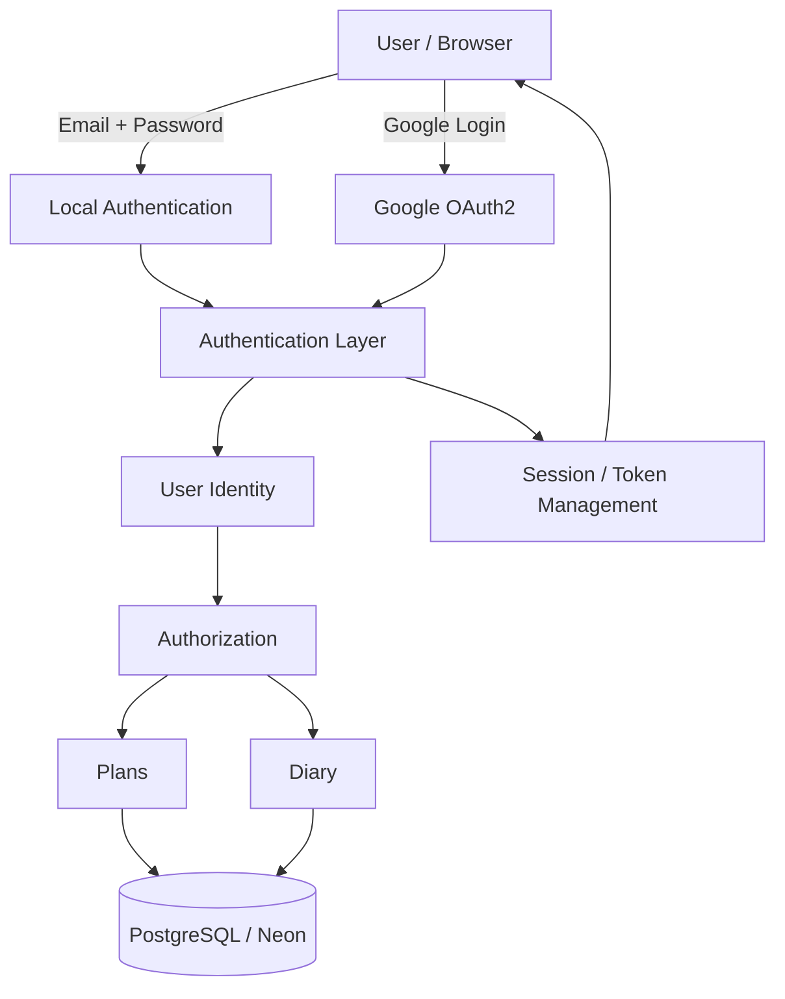
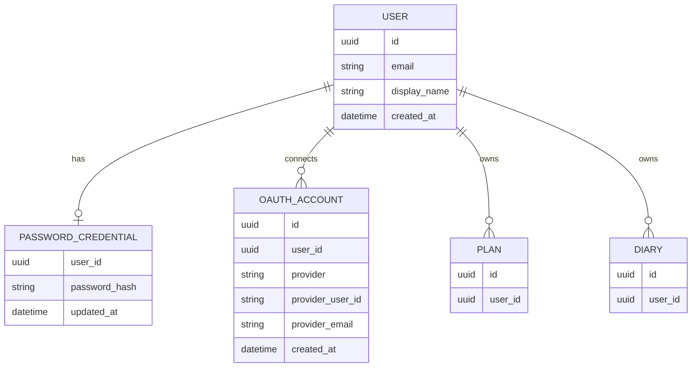
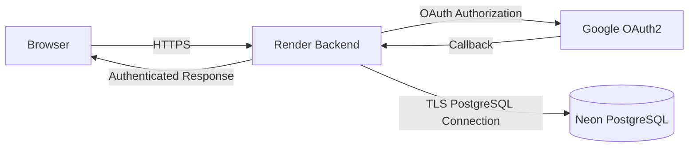

# T07 인증 구조 — 목표 설계 (Authentication Architecture)

> **이 문서는 배포된 것의 설명이 아니다.** 지금 돌아가는 T07은 이메일·비밀번호
> 하나뿐이고, Google OAuth2도 `oauth_accounts` 표도 없다. 아래는 **어디까지 가려고
> 했는가**를 적어 둔 것이고, 실제로 붙인 것은 `docs/T07-ARCHITECTURE.md`가, 못 붙인
> 것은 그 문서 11절이 말한다. 둘을 섞으면 제출물이 "막았습니다"를 근거 없이 적는
> 문서가 된다 — 이 파일을 따로 두는 이유가 그것이다.
>
> 작성: 2026-09-04. 대조한 구현: `03be4ff`.

T07은 단순한 로그인 기능 구현보다 여러 인증 방식을 하나의 사용자 계정 체계로 통합하고,
안전한 인증·인가 구조를 구성하는 것을 목표로 한다.

사용자는 두 가지 방식으로 로그인할 수 있다.

- Email / Password 기반 Local Authentication
- Google OAuth2 기반 Federated Authentication

두 인증 방식은 최종적으로 동일한 `User` 계정으로 연결되며, 인증 이후에는 같은 권한
체계를 사용하여 자신의 Plan 및 Diary 데이터에 접근한다.



## Authentication Flow

### Local Authentication

```
Browser
   │
   │ Email / Password
   ▼
Backend
   │
   ├─ User 조회
   ├─ Password Hash 검증
   └─ 인증 성공
        │
        ▼
 Authentication State
        │
        ▼
 Authorization
        │
        ▼
 User-owned Resources
```

비밀번호 원문은 데이터베이스에 저장하지 않으며 안전한 Password Hash 알고리즘을 사용하여
검증한다.

### Google OAuth2

```
Browser
   │
   │ Login with Google
   ▼
Google Authorization Server
   │
   │ Authorization Code
   ▼
Backend Callback
   │
   ├─ OAuth state 검증
   ├─ Authorization Code 교환
   ├─ Google 사용자 정보 확인
   └─ OAuth Account 조회 / 생성
          │
          ▼
        User
          │
          ▼
 Authentication State
```

OAuth2 사용자를 별도의 서비스 사용자로 관리하지 않고 내부 `User` 모델과 연결한다.

## Identity Model

인증 방식과 실제 서비스 사용자를 분리하여 관리하는 것을 목표로 한다.



## Account Linking Policy

동일한 이메일 주소가 존재한다는 이유만으로 Local Account와 OAuth Account를 자동 병합하지
않는다. 계정 연결이 필요한 경우 기존 계정에 대한 재인증 등 사용자가 해당 계정을 실제로
소유하고 있다는 것을 확인한 뒤 연결하는 것을 원칙으로 한다.

이를 통해 다음과 같은 계정 탈취 위험을 줄인다.

```
공격자가 피해자 이메일로 Local Account 생성
                ↓
피해자가 동일 이메일 Google OAuth 로그인
                ↓
이메일만 비교하여 자동 병합
                ↓
공격자가 피해자의 OAuth 계정 데이터에 접근
```

따라서 T07에서는 **Email Equality != Account Ownership** 원칙을 적용한다.

## Security Principles

- Password 원문 저장 금지
- 안전한 Password Hash 사용
- OAuth2 Authorization Code Flow 사용
- OAuth2 `state` 검증
- Redirect URI 고정
- OAuth Provider Secret 환경변수 관리
- 인증과 인가 분리
- 사용자별 Resource Ownership 검증
- 동일 이메일 기반 무조건적인 계정 자동 병합 금지
- 운영 DB와 테스트 DB 분리
- Secret 및 Database URL Git 저장소 커밋 금지
- Production 환경 HTTPS 사용

## Deployment Architecture



운영 환경의 민감정보는 소스 코드에 포함하지 않고 Render Environment Variables를 통해
주입한다. 예:

```
DATABASE_URL
CLAIM_EMAIL
CLAIM_PASSWORD

GOOGLE_CLIENT_ID
GOOGLE_CLIENT_SECRET
GOOGLE_REDIRECT_URI
```

## Design Goal

T07의 목표는 단순히 여러 로그인 기능을 추가하는 것이 아니다.

```
Local Authentication
        +
Google OAuth2
        +
Identity Integration
        +
Authorization
        +
Secure Credential Management
        +
PostgreSQL
        +
Production Deployment
```

이를 하나의 인증 시스템으로 설계하여 인증(Authentication), 사용자 식별(Identity),
권한 부여(Authorization), 안전한 운영 배포(Secure Deployment)의 전체 흐름을 직접
구현하고 설명할 수 있는 프로젝트를 목표로 한다.

---

## 부록 — 이 설계와 실제 구현의 거리

제출물이 이 문서를 근거로 읽히면 안 되므로, 어디가 다른지 여기 적어 둔다.
왼쪽은 위 설계, 오른쪽은 `03be4ff` 시점의 코드다.

| 설계 | 실제 |
| --- | --- |
| Google OAuth2 로그인 | **없다.** 이메일·비밀번호 하나뿐 |
| `OAUTH_ACCOUNT` 표 | **없다** |
| `PASSWORD_CREDENTIAL` 분리 | **없다.** `users.password_hash`에 바로 붙어 있다 |
| `USER.display_name` | **없다.** `users`는 id·email·password_hash·password_changed_at·created_at·updated_at |
| 계정 연결(Account Linking) | **없다.** 연결할 두 번째 인증 수단이 없으므로 정책도 아직 코드가 아니다 |
| Session / Token Management | **있다.** JWT 액세스 + 회전 refresh + 재사용 탐지 |
| Authorization / Ownership 검증 | **있다.** C117~C125가 양방향으로 고정 |
| Password 원문 미저장 · Argon2id | **있다.** C103·C104 |
| 운영/테스트 DB 분리 | **있다.** `conftest.refuse_production` |
| Secret 커밋 금지 | **있다.** `render.yaml`의 `sync: false` · `audit_secrets.py` |
| HTTPS · `__Host-` 쿠키 | **있다** |

**OAuth를 왜 안 붙였나.** 과제 기준(T07-C94~C99)이 요구하는 것은 가입·로그인·로그아웃과
격리이고, OAuth는 그중 어느 것도 대신하지 못한다. 반대로 붙이면 새로 생기는 것은
많다 — provider secret 두 개, redirect URI 고정, `state` 저장소, 그리고 위에 적은
**계정 병합 위험**. 5일 사용 기록(C07)이 걸린 일정에서 배포를 늦출 이유가 되지 않았다.
`docs/T07-AUTH-OPTIONS.md`에 그때의 비교가 남아 있다.

**그래도 이 문서를 남기는 이유.** 위 병합 시나리오는 지금 구현에도 절반이 해당한다.
이메일 소유 확인이 없어서 **남의 주소로 가입할 수 있고**(11절), 나중에 OAuth를 붙이는
사람이 "이메일이 같으니 같은 사람"이라고 이으면 그 순간 탈취가 완성된다. 다음 사람이
읽어야 할 것은 이 한 줄이다: **Email Equality != Account Ownership.**
